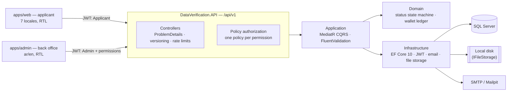
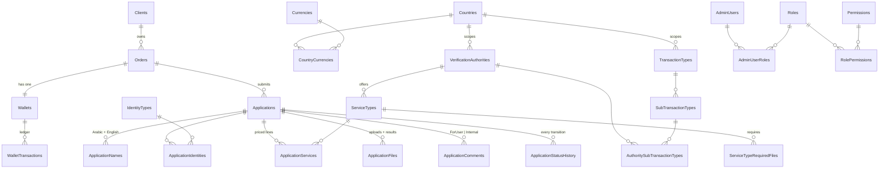
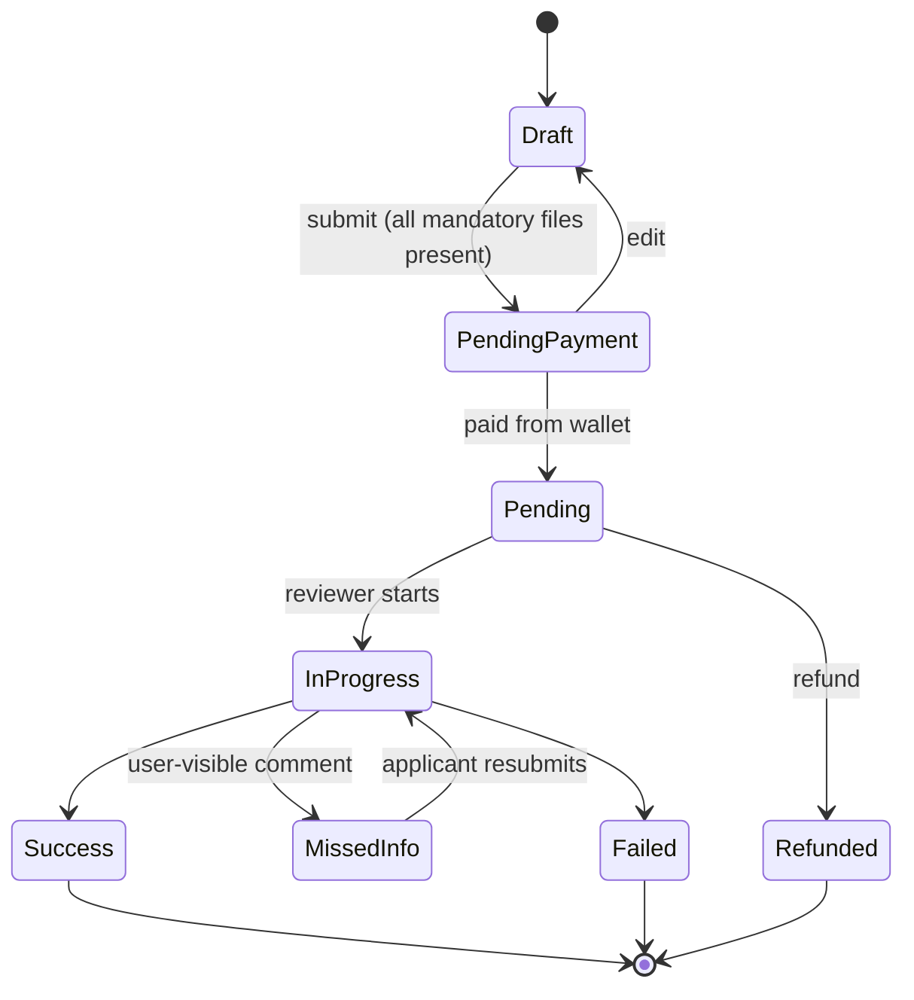

# Data Verification

Platform where applicants create an **Order** with just an email, receive generated credentials, and
submit **Applications** to verify official documents through verification authorities in a chosen
country. Payment runs through a per-Order wallet. Admins manage lookups, review applications,
exchange user-facing and internal comments, and deliver the final verified files.

Default client: **NEN** — seeded as the only record in `Clients`; every Order is created against it.

## Repository layout

```
/backend                              .NET 10 solution "DataVerification" (Clean Architecture)
  src/DataVerification.Domain         Entities, enums, status state machine, domain rules
  src/DataVerification.Application    CQRS (MediatR), FluentValidation, DTOs, interfaces
  src/DataVerification.Infrastructure EF Core 10 + SQL Server, Identity, email, file storage
  src/DataVerification.API            Controllers, /api/v1, Swagger, Serilog, JWT, ProblemDetails
  tests/DataVerification.UnitTests
  tests/DataVerification.IntegrationTests

/frontend                             pnpm workspace
  apps/web                            Applicant web app (React 19 + TS + Vite), 7 locales, RTL
  apps/admin                          Admin panel (React 19 + TS + Vite), ar/en
  packages/ui                         Shared Tailwind + shadcn/ui design system
  packages/api-client                 Typed HTTP client, ProblemDetails handling
  packages/i18n                       Shared i18next setup, locale registry, RTL helpers

/tests/api                            End-to-end HTTP verification suites (see tests/api/README.md)
/docker-compose.yml                   SQL Server 2022 + Mailpit for local development
```

Both React apps use a feature-sliced structure — `pages/`, `features/`, `entities/`, `shared/`.
Business logic never lives in components, and API access goes only through `@dv/api-client`.

## Architecture



Dependencies point inward: `Domain` references nothing, `Application` depends only on `Domain`,
and `Infrastructure` and `API` sit on the outside. The Application layer talks to persistence
through `IApplicationDbContext`, so no feature code takes a dependency on EF Core's provider.

## Data model



The CLR type behind `Applications` is named `VerificationApplication`, because `Application`
would collide with the `DataVerification.Application` namespace.

## Application lifecycle



Anything not on this diagram is rejected by `VerificationApplication.TransitionTo` with
`application.illegal_status_transition`. Edit and delete are permitted only before payment;
refund only while `Pending`.

## Prerequisites

| Tool       | Version tested |
| ---------- | -------------- |
| .NET SDK   | 10.0.100       |
| Node.js    | 24.x           |
| pnpm       | 11.x           |
| Docker     | 28.x           |

## Running everything

**1. Start the infrastructure** (SQL Server on `localhost,1433`, Mailpit on `localhost:8025`):

```bash
docker compose up -d db mailpit
```

**2. Run the API** — listens on `http://localhost:5088`, Swagger at `/swagger`:

```bash
cd backend
dotnet run --project src/DataVerification.API
```

Health check: `GET http://localhost:5088/api/v1/health` → `200 OK`.

**3. Run the front ends:**

```bash
cd frontend
pnpm install
pnpm dev            # both apps in parallel
pnpm dev:web        # applicant app only  → http://localhost:5173
pnpm dev:admin      # admin panel only    → http://localhost:5174
```

Both Vite dev servers proxy `/api` to the backend, so no CORS setup is needed in development.

## Configuration

Backend settings live in `backend/src/DataVerification.API/appsettings.json`. The values below are
development defaults — override them with user secrets or environment variables in any real
environment.

| Section                            | Purpose                                                     |
| ---------------------------------- | ----------------------------------------------------------- |
| `ConnectionStrings:DefaultConnection` | SQL Server connection string                              |
| `Jwt`                              | Issuer, audience, signing key, token lifetimes              |
| `Smtp`                             | Outgoing mail; points at Mailpit in dev                     |
| `Storage`                          | Upload root path, 5 MB limit, allowed extensions            |
| `App`                              | Web/admin URLs used in emails, default client, locales      |
| `Cors:AllowedOrigins`              | Origins allowed to call the API directly                    |

Never commit a real `Jwt:SigningKey`. Set it locally with:

```bash
cd backend/src/DataVerification.API
dotnet user-secrets set "Jwt:SigningKey" "<a 32+ byte random secret>"
```

## Demo script

Walks the whole product with the seeded NEN client and Egypt lookups. Start the database, API and
both front ends first (see *Running everything*).

**1 — Create an order.** Open <http://localhost:5173>, pick a language, enter any email. SMTP is
disabled in development, so the credentials appear on the success screen (and in the API log);
with Mailpit running they also arrive at <http://localhost:8025>.

**2 — Sign in and set up.** Follow *Go to sign in* — the order number is prefilled from the deep
link. Choose **Egypt**, then **EGP**. This opens the wallet and locks both choices.

**3 — Build an application.** *New application* →
- addressed to anything, e.g. *Ministry of Higher Education*;
- Arabic and English names (first and last are required in both), a past date of birth, and one
  identity document;
- **Educational Certificate Verification → Bachelor's Degree → Supreme Council of Universities**,
  then a service. Pick *Attested Verification* to see the express toggle; *Standard Certificate
  Verification* does not offer express and says so;
- the summary shows the priced lines and the documents each service needs;
- upload the two required documents (PDF/JPG/JPEG/PNG, ≤5 MB — try a `.txt` renamed to `.pdf` to
  watch the magic-byte check reject it);
- review, then **Submit**.

**4 — Fund and pay.** The dashboard shows the application as *Awaiting payment*. Selecting it and
pressing **Pay selected** refuses: the wallet is empty. In the admin panel
(<http://localhost:5174>, `admin@dataverification.local` / `Admin#12345`) open **Orders**, find the
order, and credit it. Back in the applicant app, sign in again — the token is memory-only, so a
refresh ends the session — select one or more applications and pay them in a single transaction.

**5 — Review it.** In the admin panel, **Applications** → open the reference → **Start review**.
On the *Comments* tab post an **Internal note** (amber, padlocked) and confirm the status does not
move. Then post a **Visible to applicant** comment and watch it flip to *Information needed*.

**6 — Answer and finish.** As the applicant, the application shows a banner; reply, re-upload if
asked, and **Resubmit**. As the admin, **Mark as verified**, then upload a result file. The
applicant now sees a *Your verified documents* section with a download button.

**7 — Check the trail.** **Audit log** in the admin panel lists every status change, payment,
refund and comment with its actor. The applicant's activity timeline shows the same story minus
the internal note — which never appears in any applicant response.

## Security posture

| Concern | Treatment |
| ------- | --------- |
| Endpoint authorization | A **fallback policy** requires an authenticated user, so a new endpoint is private unless explicitly `[AllowAnonymous]`. Only health, registration and the two logins are anonymous. |
| Admin authorization | One policy per permission; permission claims ride on the JWT and are checked by `PermissionAuthorizationHandler`. |
| Order scoping | Every applicant query filters on the order id from the token. Another order's data returns **404, not 403**, so ids cannot be probed for existence. |
| Comment visibility | Internal comments are filtered in the **query layer** for applicant endpoints, never merely hidden in the UI. Covered by API and browser tests that scan raw payloads. |
| Credentials | Order numbers use an unambiguous 12-character alphabet; passwords are PBKDF2 via ASP.NET Identity. Wrong credentials and unknown accounts return an identical 401. |
| Token storage | Access tokens live **in memory only** in both SPAs — never `localStorage` — so an XSS payload cannot read them back out. |
| Uploads | Extension *and* magic bytes must agree; 5 MB cap enforced at the domain, the endpoint, `FormOptions` and Kestrel. Stored names are generated, and every resolved path is checked to be inside the storage root. |
| Downloads | Streamed through order-scoped (or permission-checked admin) endpoints. Storage paths are never exposed. |
| Rate limiting | Per-IP fixed windows on registration and sign-in, configurable per environment, plus per-account lockout after five failures. |
| Error responses | RFC 7807 with a stable machine-readable `code` and a trace id. Stack traces are never serialized, in any environment. |
| CSRF | Not applicable: authentication is a `Authorization: Bearer` header, not an ambient cookie, so there is no credential for a cross-site form post to ride on. |
| Response headers | `nosniff`, `DENY` framing, `no-referrer`, a restrictive `Permissions-Policy`, and `same-origin` resource policy. The `Server` header is suppressed. |

## Quality gates

```bash
cd backend  && dotnet build && dotnet test
cd frontend && pnpm lint && pnpm typecheck && pnpm build
```

## Test layers

Four layers, each covering what the one below it cannot reach.

| Layer | Count | What it is for |
| --- | --- | --- |
| Domain unit tests | 57 | The aggregate rules in isolation — the status graph, wallet arithmetic, editability. No database, no HTTP. |
| Integration tests | 35 | The API booted in-process against **real SQL Server**, driven over HTTP. Pins the fail-closed authorization posture, order scoping, the paid/unpaid boundary and internal-comment filtering. |
| API verification suites | 235 | Long scripted journeys against a running instance — the whole lifecycle end to end, including admin workflows. |
| Browser tests | 65 | Playwright across both SPAs: all seven locales, RTL, the wizard with real uploads, payment and review. |

The integration tests deliberately use SQL Server rather than the in-memory provider. The behaviour
worth testing lives partly in the database — the retrying execution strategy that wraps wallet
payments, `rowversion` concurrency, unique indexes, and the cascade paths the migration had to work
around. The in-memory provider accepts all of that silently, so a suite built on it would stay
green while the deployed system failed.

```bash
cd backend  && dotnet test                            # unit + integration
pwsh tests/api/run-all.ps1                            # 235 API checks (API must be running)
cd frontend && pnpm --filter @dv/i18n check:locales   # locale integrity
cd frontend && pnpm --filter @dv/web e2e              # applicant app (API must be running)
cd frontend && pnpm --filter @dv/admin e2e            # admin panel (API must be running)
```

The integration suite reuses a `DataVerification_IntegrationTests` database and applies migrations
on boot, so repeat runs are cheap. Every test registers its own order rather than assuming an empty
table; point it elsewhere with `INTEGRATION_TESTS_CONNECTION`.

## Build status

**Complete** — prompts 0–11.

Verified: backend builds with **0 warnings**, frontend lints and typechecks clean, **57 unit
tests**, **35 integration tests**, **235 end-to-end API checks**, and **65 Playwright browser
tests** across both apps — covering all seven locales, RTL throughout, the six-step wizard with
real file uploads, multi-application payment, refunds, the review conversation, and the
permission-aware admin panel.

### Locale integrity

`pnpm --filter @dv/i18n check:locales` fails the build if a key is missing from any bundle, if a
value contains text from the wrong script (Cyrillic inside the Chinese file, for example), or if a
non-Latin locale still holds untranslated ASCII. Plural suffixes are normalised before comparison,
since plural categories legitimately differ — Arabic has six, Chinese has one.

| Area | Delivered |
| ---- | --------- |
| Domain & persistence | 28 entities, status state machine, wallet ledger, EF migrations, idempotent seed |
| Auth | Order register/login/setup, admin login, JWT, 13 permissions, policy-based RBAC |
| Lookups | Applicant cascade (country → transaction → sub-type → authority → service) + admin CRUD |
| Applications | Create/update/delete/submit, server-side pricing, uploads with magic-byte validation |
| Wallet | Multi-application atomic payment, refunds, admin credit, full ledger |
| Review | Status workflow, dual-visibility comments, merged timeline, result delivery, audit log |
| Web onboarding | 7 locales with RTL for ar/ur, landing, registration, sign-in, order setup, route guards |
| Application wizard | 6 steps, cascading selects with confirm-on-reset, express gating, server-priced summary, drag-and-drop upload with client validation, autosaved draft |
| Order dashboard | Applications table with server-driven row actions, multi-select payment in one transaction, refunds, wallet ledger, tabbed details, chat-style RTL-aware activity timeline, result downloads |
| Admin panel | Permission-aware sidebar, dashboard, 7-tab lookups CRUD, order search with wallet credit/refund, review queue with dual-visibility comments and inline file preview, roles & permissions, admin users, audit log — Arabic and English, RTL-aware |

### Known limitations

- **No payment gateway.** Wallets are topped up by an admin via `POST /admin/orders/{id}/wallet/credit`.
- **Local disk storage only.** `IFileStorage` is abstracted for S3/Azure Blob but only the disk
  provider is implemented.
- **Permissions are baked into the JWT.** Revoking one takes effect at the next login, not immediately.
- **Access tokens live in memory only** (both apps). This is deliberate — an XSS payload cannot
  read them back out of storage — but it means a full page refresh ends the session and the user
  signs in again. There is no refresh-token rotation yet.

### File encoding

Two opposite rules, both enforced:

- **C# files containing non-ASCII text must be UTF-8 *with* BOM** (`.editorconfig` sets
  `charset = utf-8-bom`). Without it the compiler reads them in the machine's ANSI codepage and
  silently turns Arabic, Urdu, Hindi and Chinese literals into `?` — the build still succeeds.
- **JSON files must be UTF-8 *without* BOM.** A BOM makes `package.json` and `tsconfig.json`
  unparseable (`SyntaxError: Unexpected token ''`). PowerShell's `-Encoding utf8` writes one, so
  prefer `[System.IO.File]::WriteAllText` with `UTF8Encoding($false)` when scripting edits.

### Note on source encoding

C# files containing non-ASCII text **must** be saved as UTF-8 **with BOM** (enforced by
`.editorconfig`). Without the BOM the compiler reads them in the machine's ANSI codepage and
silently replaces Arabic, Urdu, Hindi and Chinese literals with `?` — the build still succeeds and
the damage only shows up in the database.
